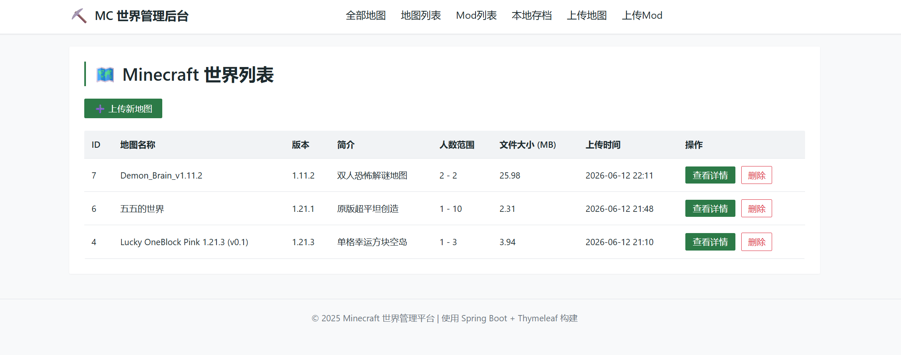
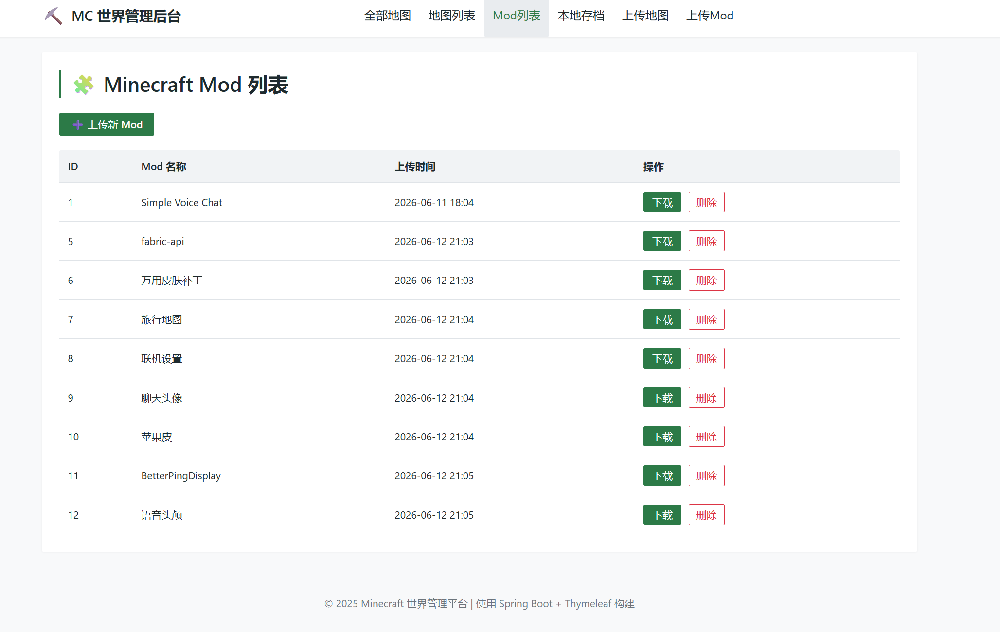
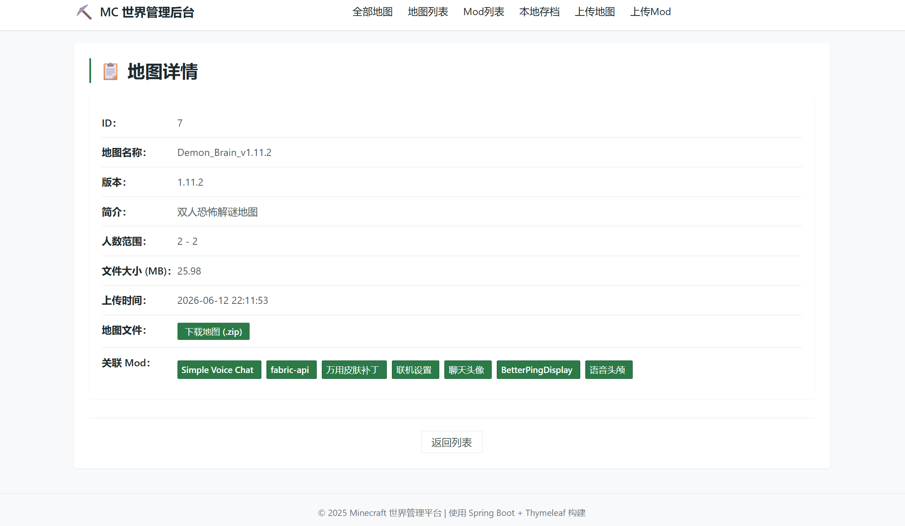
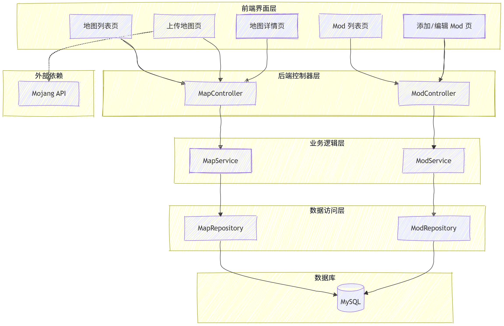

# MC世界管理平台

一个基于 Spring Boot + Thymeleaf + JDBC 的 Minecraft 世界（地图）管理后台，支持地图上传、下载、关联 Mod、多来源管理等功能。

---





## ✨ 功能特性

- 📁 **地图管理**
    - 上传地图（.zip 文件）及可选资源包
    - 编辑地图元数据（名称、版本、简介、人数范围）
    - 删除地图
    - 下载地图文件（自动生成文件名：地图名\_版本号.zip）

- 🧩 **Mod 管理**
    - Mod 列表展示（名称、下载链接）
    - 上传新 Mod（名称 + 下载链接）
    - 编辑/删除 Mod
    - 下载地图时可关联多个 Mod，详情页展示关联 Mod 列表

- 🎮 **来源区分**
    - 支持“本地地图”和“下载地图”两种来源
    - 下载地图允许关联 Mod，并在详情页显示

- 🌐 **版本号动态加载**
    - 通过 Mojang 官方 API 实时获取 Minecraft Java 版所有正式版本号
    - 上传页面自动填充版本下拉框（最新在前）

- 🎨 **现代化 UI**
    - 浅色主题，CSS 变量统一管理颜色和尺寸
    - 响应式布局（桌面/移动端适配）
    - 自定义文件上传按钮、表格悬停高亮、卡片式详情页

---

## 🛠 技术栈

| 技术 | 版本 | 说明 |
|------|------|------|
| Java | 11+ | 后端语言 |
| Spring Boot | 2.7.18 | 快速开发框架 |
| Spring JDBC | - | 数据库访问（JdbcTemplate）|
| MySQL | 8.0 | 数据库 |
| Thymeleaf | 3.0+ | 服务端模板引擎 |
| Maven | 3.6+ | 项目构建 |
| HTML5 / CSS3 / JavaScript | - | 前端界面 |

---

## 📁 项目结构

```
src/
├── main/
│   ├── java/com/mycapper/
│   │   ├── controller/      # 控制器层（地图、Mod 管理）
│   │   ├── service/         # 业务逻辑层
│   │   ├── repository/      # 数据访问层（JdbcTemplate）
│   │   ├── entity/          # 实体类（MapData, ModData）
│   │   └── config/          # 配置文件（可选）
│   └── resources/
│       ├── static/          # 静态资源（CSS、JS）
│       │   ├── css/style.css
│       │   └── js/script.js
│       ├── templates/       # Thymeleaf 模板
│       │   ├── maps/
│       │   │   ├── list.html      # 地图列表页
│       │   │   ├── add.html       # 上传地图页
│       │   │   └── view.html      # 地图详情页
│       │   └── mods/
│       │       ├── list.html      # Mod 列表页
│       │       ├── add.html       # 添加 Mod 页
│       │       └── edit.html      # 编辑 Mod 页
│       └── application.yml        # 配置文件
└── pom.xml
```

---

## 🚀 快速开始

### 1. 环境要求
- JDK 11 或更高版本
- MySQL 8.0
- Maven 3.6+

### 2. 克隆项目
```bash
git clone https://github.com/Huauaua/MCWorldManager.git
cd MCWorldManager
```

### 3. 创建数据库
登录 MySQL，执行以下 SQL：
```sql
CREATE DATABASE mc_maps;
USE mc_maps;

-- 创建地图表
CREATE TABLE maps (
    id INT PRIMARY KEY AUTO_INCREMENT,
    map_name VARCHAR(100) NOT NULL,
    version VARCHAR(20),
    map_zip LONGBLOB NOT NULL,
    resource_pack LONGBLOB,
    description TEXT,
    min_players INT DEFAULT 1,
    max_players INT DEFAULT 10,
    file_size BIGINT,
    import_time TIMESTAMP DEFAULT CURRENT_TIMESTAMP,
    source VARCHAR(20) DEFAULT 'local'
);

-- 创建 Mod 表
CREATE TABLE mods (
    id INT PRIMARY KEY AUTO_INCREMENT,
    mod_name VARCHAR(100) NOT NULL,
    download_url VARCHAR(500) NOT NULL,
    created_at TIMESTAMP DEFAULT CURRENT_TIMESTAMP
);

-- 创建地图-Mod 关联表
CREATE TABLE map_mods (
    map_id INT,
    mod_id INT,
    PRIMARY KEY (map_id, mod_id),
    FOREIGN KEY (map_id) REFERENCES maps(id) ON DELETE CASCADE,
    FOREIGN KEY (mod_id) REFERENCES mods(id) ON DELETE CASCADE
);
```

### 4. 修改数据库配置
编辑 `src/main/resources/application.yml`：
```yaml
spring:
  datasource:
    url: jdbc:mysql://localhost:3306/mc_maps?useSSL=false&serverTimezone=Asia/Shanghai
    username: root
    password: 你的密码
  servlet:
    multipart:
      max-file-size: 100MB
      max-request-size: 100MB

server:
  port: 8080
```

### 5. 编译与运行
```bash
mvn clean spring-boot:run
```

### 6. 访问应用
打开浏览器，访问 `http://localhost:8080/maps/`

---

## 📝 使用说明

### 上传地图
1. 点击“上传新世界”
2. 填写地图名称、选择版本（自动加载 Mojang 版本列表）、选择来源（本地/下载）
3. 填写简介、人数范围
4. 上传地图 ZIP 文件（必须）和资源包 ZIP（可选）
5. 若来源为“下载地图”，可勾选关联的 Mod
6. 点击“上传”

### 管理 Mod
- 在 Mod 列表页可添加、编辑、删除 Mod
- 添加 Mod 需提供名称和下载链接（URL）
- Mod 删除后，关联的地图- Mod 关系会自动清除（外键级联）

### 查看地图详情
- 在地图列表页点击“查看详情”
- 可看到地图完整信息、下载链接、关联的 Mod 列表

---

## ⚙️ 配置优化

### 文件上传大小限制
已在 `application.yml` 中配置 `max-file-size=100MB`，可根据需要调整。

### MySQL 大包限制（可选）
如果上传的地图文件超过 16MB，可能需要调高 MySQL 的 `max_allowed_packet`。编辑 MySQL 配置文件（如 `my.ini`），在 `[mysqld]` 下添加：
```ini
max_allowed_packet=256M
```
然后重启 MySQL 服务。

---

## 🤝 贡献

欢迎提交 Issue 和 Pull Request。

---

## 📄 许可证

本项目仅供学习交流使用。

---

## 📧 联系方式

如有问题，请发邮件至 1775778681@qq.com

---

**Made with ❤️ for Minecraft players**